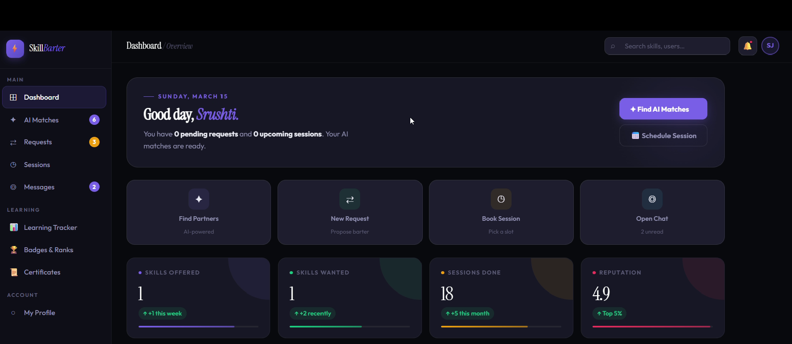
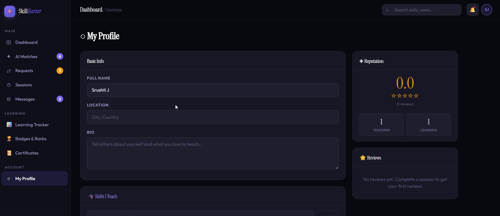
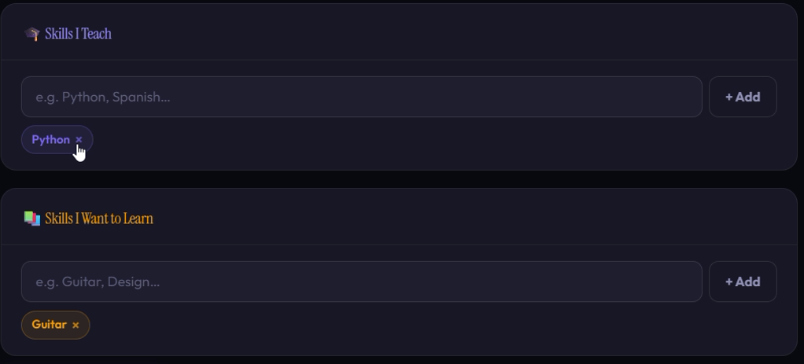
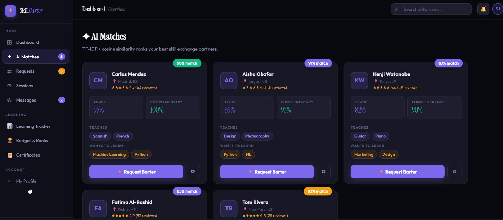
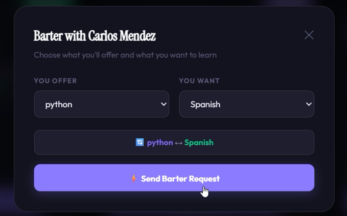
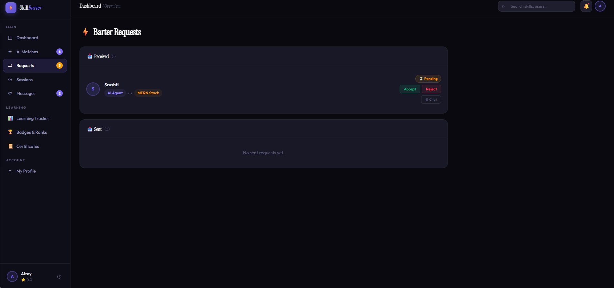
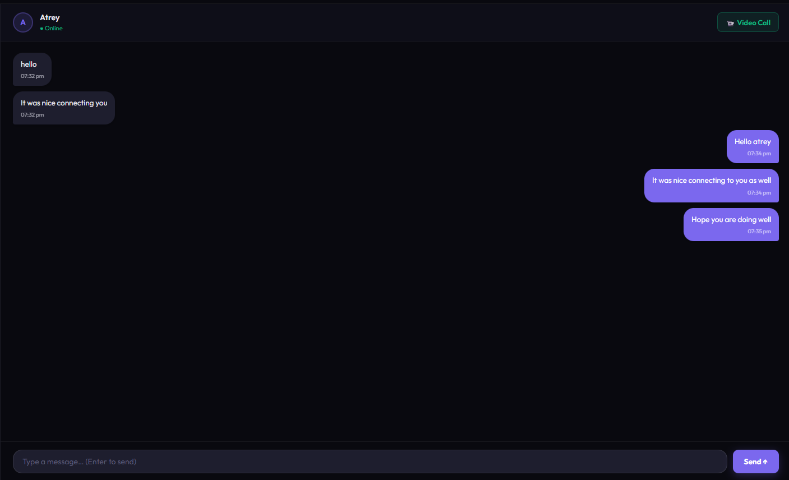
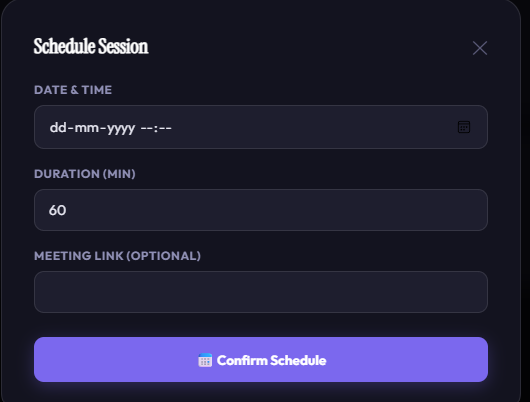
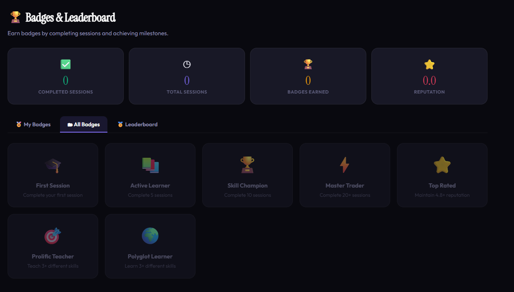

# SkillBarter Platform v2

> **An AI-powered Skill Exchange Platform** where users can teach what they know and learn what they need through intelligent skill matching, real-time communication, session scheduling, and a reputation-based learning ecosystem.


---

## Overview

SkillBarter Platform is an AI-powered peer-to-peer learning platform that enables users to exchange skills instead of paying for courses. The system intelligently matches users based on the skills they offer and the skills they want to learn, enabling collaborative knowledge sharing through real-time communication, scheduling, and reputation tracking.
## Key Highlights

- AI-powered skill recommendation engine
- Real-time chat using Socket.IO
- JWT authentication and authorization
- Profile image upload with Multer
- Live online/offline presence
- Typing indicators
- Reputation and review system
- Session scheduling
---

# Features

###  Authentication

* Secure user registration and login
* JWT-based authentication
* Protected routes
* Persistent login sessions

###  User Profile

* Create and edit profile
* Upload profile picture
* Add skills offered
* Add skills wanted
* Set proficiency levels
* Profile completeness validation

###  AI Skill Matching

* AI-powered user recommendations
* Intelligent compatibility scoring
* Filters incomplete profiles
* Returns only real MongoDB users
* Automatic fallback scoring if AI service is unavailable

###  Skill Requests

* Send barter requests
* Accept or reject requests
* Instant request notifications
* Request history

###  Real-Time Chat

* One-to-one messaging
* Socket.IO powered
* User ID based rooms
* Typing indicators
* Online/offline status
* Conversation history

###  Session Management

* Schedule learning sessions
* Complete sessions
* Cancel sessions
* Track session history

###  Reviews & Reputation

* Rate learning partners
* Leave reviews
* Reputation score calculation
* Community trust system

###  Live Notifications

* New barter requests
* Request accepted/rejected
* New messages
* Online users
* Typing indicators

---

#  What's New in Version 2

| Previous Issue                     | Fixed in v2                                |
| ---------------------------------- | ------------------------------------------ |
| Dummy users shown in matches       | Only real MongoDB users are matched        |
| Anyone could chat                  | Chat allowed only after request acceptance |
| Socket IDs caused multi-tab issues | User ID based rooms implemented            |
| No real-time notifications         | Live notifications using Socket.IO         |
| No profile image upload            | Multer image upload added                  |
| No typing indicator                | Typing events implemented                  |
| No online/offline status           | Live user presence tracking                |
| Empty profiles appeared in matches | Profile completeness validation added      |

---

#  Tech Stack

## Frontend

* React.js
* React Router
* Axios
* Context API
* CSS

## Backend

* Node.js
* Express.js
* MongoDB
* Mongoose
* JWT Authentication
* Multer
* Socket.IO

## AI Module

* Python
* FastAPI
* Scikit-learn
* TF-IDF Vectorizer
* Cosine Similarity

---

## Project Structure

```text
SkillBarter-Platform/
│
├── sb/
│   ├── ai_module/
│   │   ├── main.py
│   │   └── requirements.txt
│   │
│   ├── backend/
│   │   ├── config/
│   │   ├── controllers/
│   │   ├── middleware/
│   │   ├── models/
│   │   ├── routes/
│   │   ├── uploads/
│   │   ├── package.json
│   │   └── server.js
│   │
│   ├── frontend/
│   │   ├── public/
│   │   ├── src/
│   │   │   ├── components/
│   │   │   ├── context/
│   │   │   ├── pages/
│   │   │   ├── services/
│   │   │   ├── styles/
│   │   │   ├── App.jsx
│   │   │   └── main.jsx
│   │   └── package.json
│   │
│   └── screenshots/
│       ├── dashboard.png
│       ├── ai-matches.png
│       ├── skills.png
│       ├── send-barter-request.png
│       ├── barter-request.png
│       ├── chat-interface.png
│       ├── schedule-session.png
│       ├── my-profile.png
│       └── badges-and-leaderboard.png
│
├── .gitignore
└── README.md
```

---

#  End-to-End Workflow

1. User registers and logs in.
2. User completes profile by adding skills offered and skills wanted.
3. AI recommendation engine finds the best learning partners.
4. User sends a barter request.
5. Receiver gets an instant notification.
6. Receiver accepts the request.
7. Chat becomes available automatically.
8. Users schedule learning sessions.
9. Session is completed.
10. Both users leave ratings and reviews.
11. Reputation score is updated.

---

#  Real-Time Socket.IO Events

| Event                    | Direction                | Description                    |
| ------------------------ | ------------------------ | ------------------------------ |
| `user_online`            | Client → Server          | Join personal room             |
| `new_request`            | Server → Client          | New barter request             |
| `request_status_changed` | Server → Client          | Accepted/Rejected notification |
| `send_message`           | Client → Server          | Send message                   |
| `receive_message`        | Server → Client          | Receive message                |
| `typing_start`           | Client → Server → Client | Typing started                 |
| `typing_stop`            | Client → Server → Client | Typing stopped                 |
| `online_users`           | Server → All             | Online users list              |

---
#  Installation
##Clone Repository
```bash
git clone https://github.com/Srushti-J/SkillBarter_Platform.git

cd SkillBarter_Platform
```
### Backend

```bash
cd sb/backend
npm install
npm run dev
```

### Frontend

```bash
cd sb/frontend
npm install
npm start
```

### AI Module

```bash
cd sb/ai_module

python -m venv venv
```

Windows

```bash
venv\Scripts\activate
```

Linux / macOS

```bash
source venv/bin/activate
```
Install dependencies
```bash
pip install -r requirements.txt
```
Start FastAPI
```bash
uvicorn main:app --reload --port 8000
```
#  Environment Variables

## Backend (.env)

```env
MONGO_URI=mongodb://localhost:27017/skillbarter

JWT_SECRET=your_secret_key

CLIENT_URL=http://localhost:3000

AI_SERVICE_URL=http://localhost:8000/recommend

PORT=5000

NODE_ENV=development
```

---

## Frontend (.env)

```env
REACT_APP_API_URL=http://localhost:5000/api

REACT_APP_SOCKET_URL=http://localhost:5000
```

---

#  AI Recommendation Engine

The AI module recommends compatible learning partners using Natural Language Processing.

### Workflow

* User enters skills offered.
* User enters skills wanted.
* Skills are converted into TF-IDF vectors.
* Cosine similarity is calculated.
* Best matching users are ranked.
* Recommendations are returned to the frontend.

If the AI service is unavailable, the backend automatically falls back to rule-based scoring.

---

##  Dashboard

<p align="center">
  
</p>

##  My Profile

<p align="center">
  
</p>

##  Skills

<p align="center">
  
</p>

##  AI Matches

<p align="center">
  
</p>


##  Send Barter Request

<p align="center">
  
</p>

##  Barter Request

<p align="center">
  
</p>

##  Chat Interface

<p align="center">
  
</p>

##  Schedule Session

<p align="center">
  
</p>


##  Badges & Leaderboard

<p align="center">
  
</p>
#  Future Enhancements

*  Video calling
*  LLM-powered recommendations
*  Google Calendar integration
*  Email notifications
*  Mobile application
*  Achievement badges
*  Multi-language support
*  Analytics dashboard
*  Semantic search using Sentence Transformers

---

#  Contributing

Contributions are welcome.

1. Fork the repository.
2. Create a new branch.

```bash
git checkout -b feature-name
```

3. Commit changes.

```bash
git commit -m "Added new feature"
```

4. Push to GitHub.

```bash
git push origin feature-name
```

5. Open a Pull Request.

---

#  License

This project is licensed under the MIT License.

---

#  Author

**Srushti Joshi**

Information Science & Engineering Student

Passionate about AI, Machine Learning, Full-Stack Development, and Building Intelligent Applications.

**GitHub:** https://github.com/Srushti-J

**LinkedIn:** https://www.linkedin.com/in/srushti-joshi

---

